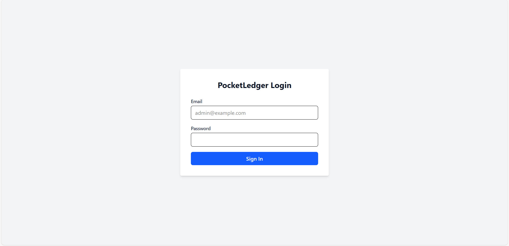
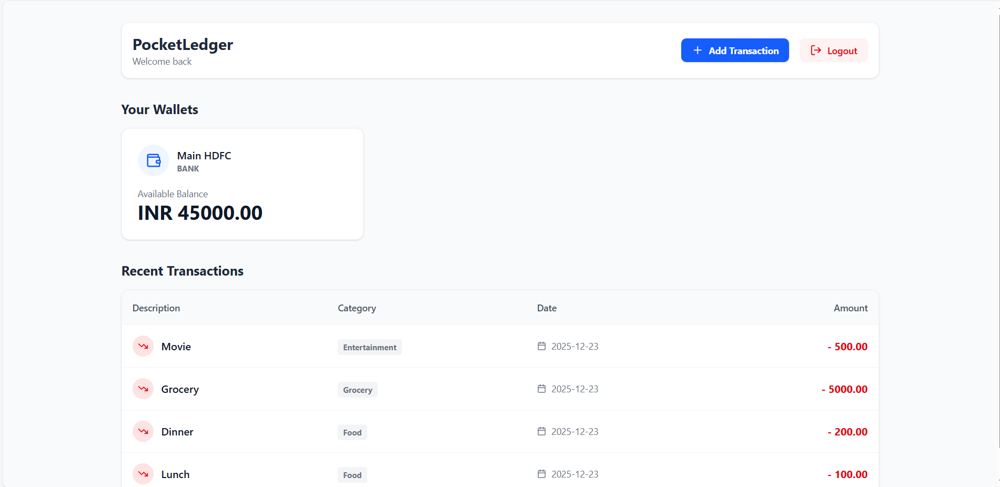
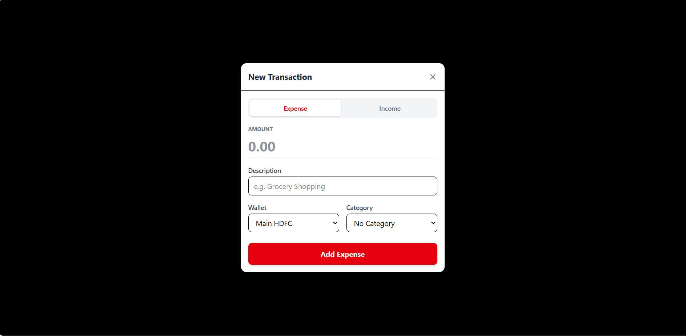

# 💰 PocketLedger

**A Full-Stack Financial Tracking Application**

PocketLedger is an industry-standard personal finance application designed to track wallets, transactions, and categories with real-time balance updates. Built with a robust **Django REST Framework** backend and a responsive **React + Tailwind** frontend.


## 📸 Screenshots





## ✨ Key Features

* **🔐 Secure Authentication:** Custom User model with JWT (JSON Web Tokens) access & refresh rotation.
* **💼 Wallet Management:** Create multiple wallets (Cash, Bank, Savings) with multi-currency support.
* **💸 Smart Transactions:** Record Income & Expenses with automatic wallet balance updates (using Django Signals).
* **📊 Interactive Dashboard:** React-based UI with real-time data fetching and transaction history.
* **⚡ Modern Stack:** Built with `uv` (fast Python package manager) and Vite for lightning-fast frontend tooling.
* **🐳 Dockerized:** Fully containerized environment for easy deployment.

## 🛠️ Tech Stack

### Backend
* **Framework:** Django 5.x & Django REST Framework (DRF)
* **Authentication:** SimpleJWT
* **Database:** PostgreSQL (Production ready) / SQLite (Dev)
* **Documentation:** Drf-Spectacular (Swagger UI)

### Frontend
* **Framework:** React (Vite)
* **Styling:** Tailwind CSS
* **Icons:** Lucide React
* **HTTP Client:** Axios (with Interceptors)

### DevOps
* **Containerization:** Docker & Docker Compose
* **Environment:** Python `uv`, Node.js

---

## 🚀 Getting Started

You can run this project either **Manually** or using **Docker**.

### Option 1: Docker (Recommended for ease)

1.  **Clone the repository**
    ```bash
    git clone [https://github.com/SatyajitKumar123/PocketLedger-new-.git](https://github.com/SatyajitKumar123/PocketLedger-new-.git)
    cd pocketledger
    ```

2.  **Run with Docker Compose**
    ```bash
    docker compose up --build
    ```
    *The Backend will be available at `http://localhost:8000`*
    *The Frontend will be available at `http://localhost:5173` (or the port Docker assigns)*

---

### Option 2: Manual Setup

#### 1️⃣ Backend Setup
Prerequisites: Python 3.10+ installed.

```bash
# Navigate to root
cd pocketledger

# Create virtual env & Install dependencies (using standard pip)
python -m venv .venv
source .venv/bin/activate  # On Windows: .venv\Scripts\activate
pip install -r requirements.txt

# Apply Migrations
python manage.py migrate

# Create a Superuser (Admin)
python manage.py createsuperuser

# Run Server
python manage.py runserver